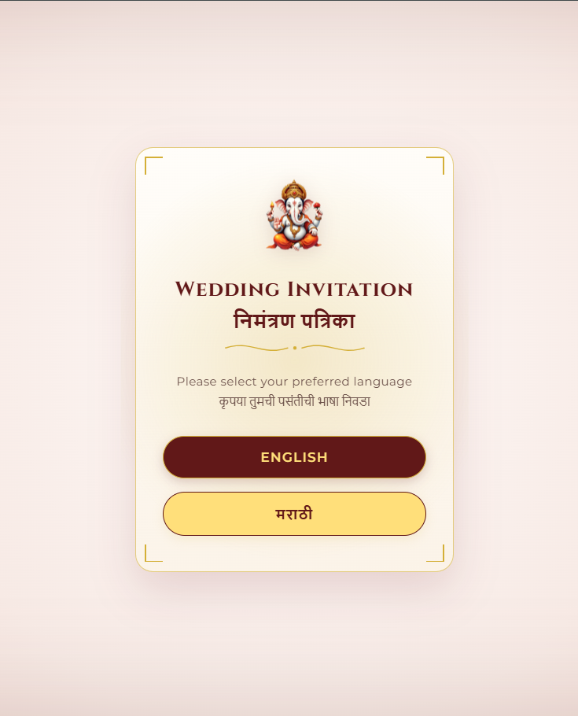
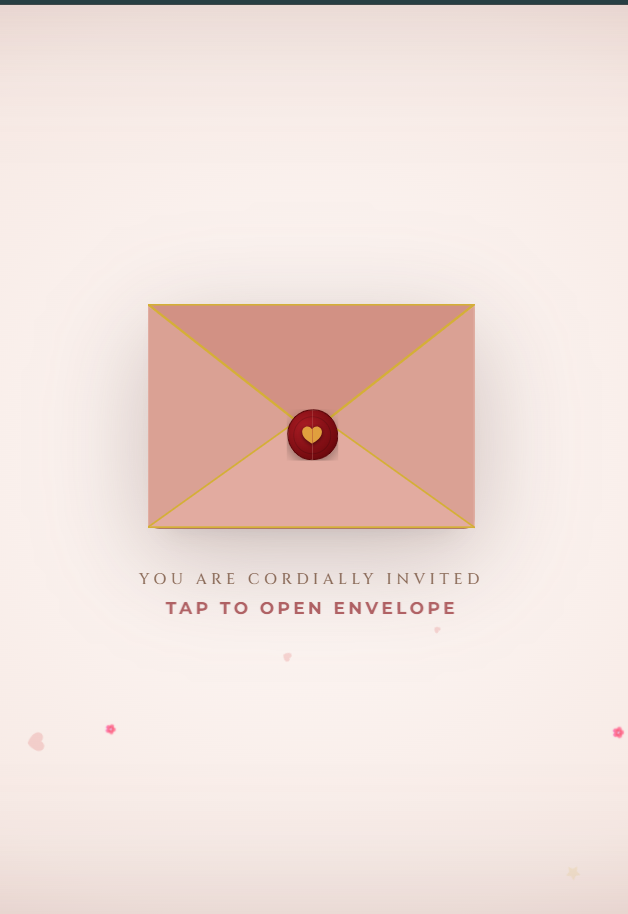
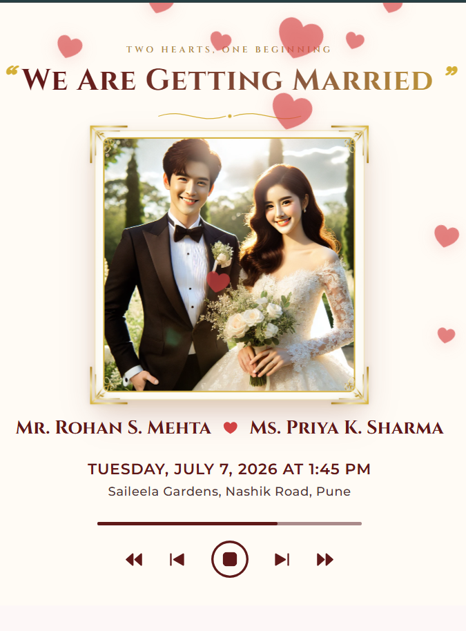
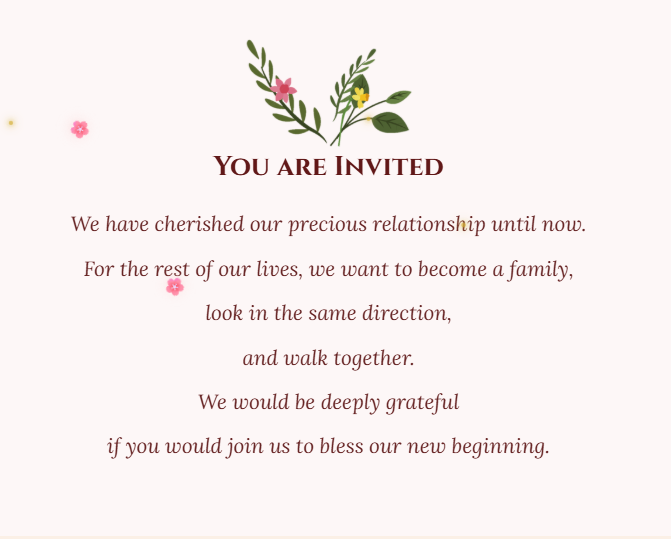
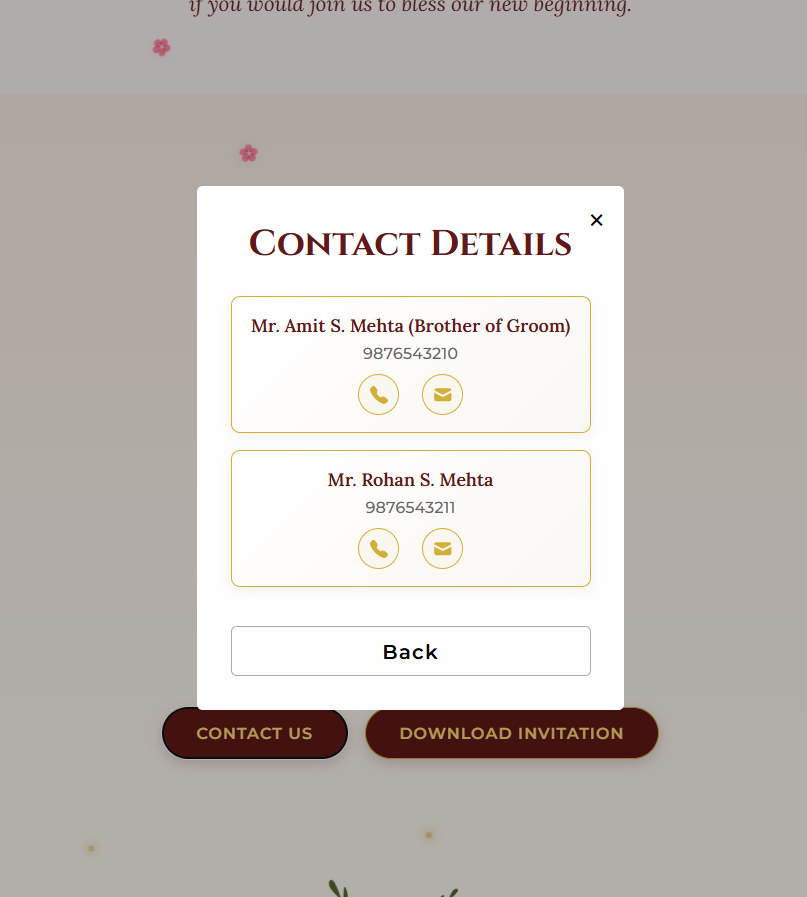
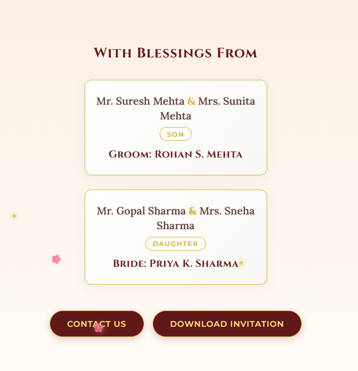
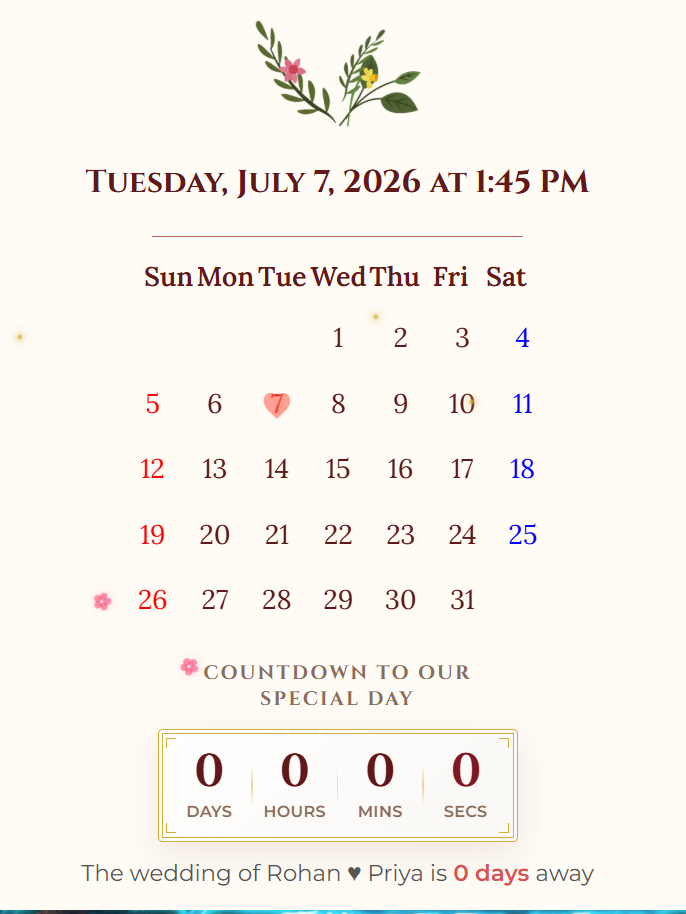
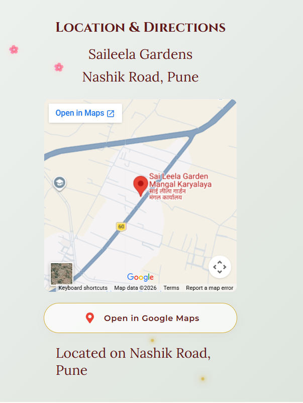
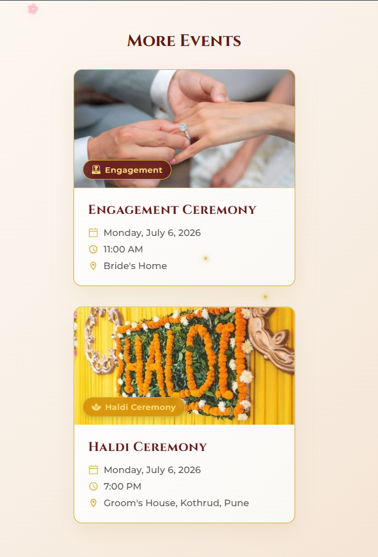
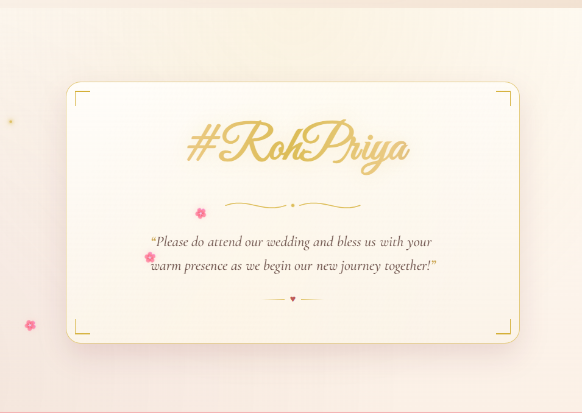

# 💍 Premium Mobile Wedding Invitation Card - React Web App

A beautiful, high-fidelity, interactive mobile wedding invitation web application built for the wedding of **Rohan & Priya** on **July 7, 2026**. This application features immersive animations, localized bilingual support (English & Marathi), interactive event maps, real-time RSVP submission, and a personalized celebratory design.

---

## 🌟 Core Features & Visual Highlights

*   **Interactive 3D Envelope Opening:** A custom physical envelope greeting addressed to the guest. Clicking it initiates a smooth 3D unfolding animation accompanied by a burst of colorful celebratory confetti.
*   **Bilingual Localization (English & Marathi):** A centralized `LanguageContext` that dynamically translates the entire user interface and text elements on-the-fly, allowing guests to switch preferences instantly.
*   **Celebrating Background Particles:** A continuous, elegant shower of global falling rose petals (🌸) and golden dust sparkles that drift down the page.
*   **Ambient Music Player:** A persistent music toggle at the top of the screen that plays romantic ambient theme music.
*   **Dynamic Countdown Timer:** A real-time ticking countdown showing the remaining Days, Hours, Minutes, and Seconds until the main wedding ceremony.
*   **3D Scroll-Pinned Photo Deck:** A premium, interactive gallery of couple memories. Utilizes GSAP and ScrollTrigger to pin, scale, rotate, and stack photos like a real Polaroid deck as the guest scrolls.
*   **3D Tilting Monogram Card (#RohPriya):** An interactive monogram signature card that reacts dynamically to cursor movements or tilts with a gold metallic shimmer effect, concluding with an ink-written quote.
*   **Real-time RSVP Form:** Connected directly to Google Firebase Firestore to securely register guests' side (Groom/Bride), names, contact details, dietary/meal preferences, and guest count.
*   **Tap-to-Call & Tap-to-SMS Integration:** Integrated phone and messaging options within the contact details modal for one-click calling or texting of hosts on mobile devices.

---

## 📱 Page & Component Breakdown

### 1. Language Selection Screen
*   **File:** [LanguageSelect.js](file:///e:/yogdip/react-wedding-card/src/components/LanguageSelect.js)
*   **Description:** The landing state before any other content loads. Prompts the guest to choose between English and Marathi. Setting the selection propagates the chosen language to all page text dynamically.
*   *Asset preview:*
    

### 2. Interactive Envelope
*   **File:** [Envelope.js](file:///e:/yogdip/react-wedding-card/src/components/Envelope.js)
*   **Description:** Displays a beautifully styled, card-like envelope containing the couple's names, date, and venue. Tapping the heart seal unfolds the flap and launches a confetti explosion.
*   *Asset preview:*
    

### 3. Wedding Cover
*   **File:** [Cover.js](file:///e:/yogdip/react-wedding-card/src/pages/Cover.js)
*   **Description:** Displays a striking cover photo, wedding theme title, the names of the groom and bride, date, and venue details. A pulsating heart emblem sits at the center, and the music controller sits in the header.
*   *Asset preview:*
    

### 4. Invitation Message & Contacts
*   **File:** [Invitation.js](file:///e:/yogdip/react-wedding-card/src/pages/Invitation.js)
*   **Description:** A heartfelt message inviting the guests to the ceremony. Includes a **Contact Us** button that displays a detailed phone list modal (with quick tap-to-call and tap-to-SMS shortcuts for mobile) and a link to download the high-resolution invitation poster.
*   *Asset preview:*
     

### 5. Family & Blessings
*   **File:** [Family.js](file:///e:/yogdip/react-wedding-card/src/pages/Family.js)
*   **Description:** Introduces the parents of both the groom and bride. Uses GSAP ScrollTrigger to animate and stagger-reveal the card panels elegantly.
*   *Asset preview:*
    

### 6. Interactive Calendar & Countdown
*   **File:** [Calendar.js](file:///e:/yogdip/react-wedding-card/src/pages/Calendar.js)
*   **Description:** Features a custom-rendered calendar grid for July 2026. The wedding date (July 7) is highlighted by a pulsing heartbeat-style icon. Below the calendar is a high-fidelity countdown timer indicating remaining time down to the second.
*   *Asset preview:*
    

### 7. Google Maps & Directions
*   **File:** [Location.js](file:///e:/yogdip/react-wedding-card/src/pages/Location.js)
*   **Description:** Displays the venue address (Saileela Gardens, Nashik Road, Pune) along with an embedded interactive Google Maps frame. Includes a direct shortcut link to navigate via external Google Maps.
*   *Asset preview:*
    

### 8. 3D Polaroid Scroll Gallery
*   **File:** [ImgGallery.js](file:///e:/yogdip/react-wedding-card/src/pages/ImgGallery.js)
*   **Description:** Provides an interactive photo slideshow styled as Polaroid prints. Built using GSAP's scroll-based timeline, these images stagger-slide upwards, tilt, and stack sequentially as the user scrolls.
*   *Asset preview:*
    

### 9. Ceremonies & Events Timeline
*   **File:** [Events.js](file:///e:/yogdip/react-wedding-card/src/pages/Events.js)
*   **Description:** Displays detailed schedule information for pre-wedding ceremonies including the Engagement Ceremony (Bride's Home) and the Haldi Ceremony (Groom's House), detailing respective dates, locations, and timings.
*   *Asset preview:*
    

### 10. Ornate Monogram Card (#RohPriya)
*   **File:** [LoveLetters.js](file:///e:/yogdip/react-wedding-card/src/pages/LoveLetters.js)
*   **Description:** A custom monogram card featuring the hashtag `#RohPriya`. It utilizes GSAP animations for text reveal and mouse-tracking parameters for 3D cursor tilt effects.
*   *Asset preview:*
    

### 11. Guest RSVP Registration (Modal)
*   **Files:** [Submit.js](file:///e:/yogdip/react-wedding-card/src/pages/Submit.js) & [SurveyModal.js](file:///e:/yogdip/react-wedding-card/src/components/SurveyModal.js)
*   **Description:** Provides a form-overlay modal for gathering attendee RSVPs. Collects names, side affiliation (Bride/Groom), contacts, total guest count, meal choices, and privacy agreements, uploading submissions to Google Firebase Firestore.

---

## 🎁 Optional / Unused Pages in Codebase

*   **Surprise Quiz Game ([Quiz.js](file:///e:/yogdip/react-wedding-card/src/pages/Quiz.js)):** A fun 3-question trivia game about the couple, checking correct/incorrect options and providing a final score section.
*   **Love Story Timeline ([LoveStory.js](file:///e:/yogdip/react-wedding-card/src/pages/LoveStory.js)):** A timeline tracking major relationship milestones: *First Meet (August 2024)*, *First Date (September 2024)*, *Engagement (July 6, 2026)*, and *Wedding Day (July 7, 2026)*.

---

## 🛠️ Technology Stack & Dependencies

*   **Framework:** React (v18.2)
*   **Styles & Theme:** Custom CSS (with premium fonts, gradients, responsive configurations)
*   **Animations:** GSAP (GreenSock Animation Platform) + ScrollTrigger
*   **Database Integration:** Firebase Firestore
*   **Icons:** React Icons (`react-icons/go`, `react-icons/bs`, `react-icons/fa`, `react-icons/gi`, `react-icons/md`)
*   **External Maps:** Embedded Google Maps Frame
*   **Routing & Deploy:** Built via React-Scripts & deployable through GitHub Pages (`gh-pages`)

---

## 🚀 Setup & Installation Guide

Follow these steps to run the application locally or deploy it.

### Prerequisites
Make sure you have Node.js and npm installed.

### 1. Clone the Repository
```bash
git clone https://github.com/ayushchoudhar5/react-wedding-card.git
cd react-wedding-card
```

### 2. Install Dependencies
```bash
npm install
```

### 3. Setup Firebase Config
Create a `src/firebase-config.js` file if it doesn't exist, and add your Firebase credentials:
```javascript
import { initializeApp } from "firebase/app";
import { getFirestore } from "firebase/firestore";

const firebaseConfig = {
  apiKey: "YOUR_API_KEY",
  authDomain: "YOUR_AUTH_DOMAIN",
  projectId: "YOUR_PROJECT_ID",
  storageBucket: "YOUR_STORAGE_BUCKET",
  messagingSenderId: "YOUR_MESSAGING_SENDER_ID",
  appId: "YOUR_APP_ID"
};

const app = initializeApp(firebaseConfig);
const db = getFirestore(app);

export default db;
```

### 4. Run Development Server
```bash
npm start
```
The application will open on [http://localhost:3000](http://localhost:3000) inside your browser.

### 5. Build for Production
```bash
npm run build
```

### 6. Deployment (GitHub Pages)
```bash
npm run deploy
```
